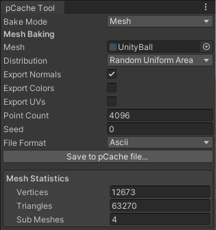
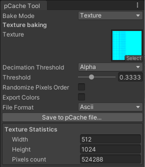

# 点缓存烘焙工具

Point Cache Bake Tool 是一个工具，可用于烘焙 Point Cache，以便在依赖于复杂几何体的视觉效果中使用。该工具采用输入 [Mesh](https://docs.unity3d.com/Manual/class-Mesh.html) 或 [Texture2D ](https://docs.unity3d.com/ScriptReference/Texture2D.html) 并生成其 [Point Cache 资源](point-cache-asset.md) 表示形式，您可以在视觉效果中使用该表示。

有关什么是 Point Cache 以及它们可以用于什么的信息，请参阅 [Visual Effect Graph 中的 Point Cache](point-cache-in-vfx-graph.md)。

Point Cache Bake Tool 使用一个窗口界面，该界面指定输入 Mesh/Texture2D 以及控制输出 Point Cache 的各种属性。要打开 Point Cache Bake Tool 窗口，请单击**Window > Visual Effects > Utilities > Point CacheBake Tool**。

## 使用 Point Cache Bake Tool 窗口

Point Cache Bake Tool 有两种烘焙模式：

- **Mesh**: 从输入网格资源烘焙 Point Cache。
- **Texture**: 从输入 Texture2D 资源烘焙 Point Cache。

根据您选择的模式，该窗口会显示不同的属性来控制烘焙过程。指定输入 Mesh/Texture2D 并设置属性后，单击 **Save to pCache file...**（保存到 pCache 文件...）以烘焙 Point Cache 并将结果保存到 Point Cache 资产。

## 属性

### 常规

无论选择哪种 **Bake Mode**，这些属性都会显示在 Inspector 中。

| **属性**    | **描述**                                              |
| --------------- | ------------------------------------------------------------ |
| **Bake Mode**   | 指定要从中烘焙 Point Cache 的输入类型。选项包括： &#8226; **Mesh**: 从输入网格资产烘焙 Point Cache。 &#8226; **Texture**: 从输入 Texture2D 资产烘焙 Point Cache。 |
| **Seed**        | 用于生成 Point Cache 的随机种子。         |
| **File Format** | S指定用于对 Point Cache 进行编码的格式。选项包括： &#8226; **Ascii**: 使用 Ascii 编码。 &#8226; **Binary**: 使用二进制编码。 |

### 网格烘焙

仅当您将 **Bake Mode** 设置为 **Mesh** 时，才会显示此部分。

 *Inspector 中 Point Cache Bake Tool 的 Mesh Baking 部分。*

| **属性**       | **描述**                                              |
| ------------------ | ------------------------------------------------------------ |
| **Mesh**           | 要生成 Point Cache 表示的 Mesh。     |
| **Distribution**   | 指定 Point Cache Bake Tool 用于对输入网格进行采样的点散射技术。选项包括： &#8226; **Sequential**: 按顺序在每个三角形/顶点处创建一个点。 &#8226; **Random**: 在每个三角形/顶点处随机创建一个点。如果 **Bake Mode** 设置为 **Triangle**，则此选项不考虑三角形的面积。 &#8226; **Random Uniform Area**: 在每个三角形处随机创建一个点。此选项考虑了三角形的面积。 |
| **Bake Mode**      | 指定如何烘焙网格。选项包括：  &#8226; **Vertex**: 基于每个顶点烘焙网格。 &#8226; **Triangle**: 基于每个三角形烘焙网格。   仅当将 **Distribution** 设置为 **Sequential** 或 **Random** 时，才会显示此属性。如果将 **Distribution** 设置为 **Random Uniform Area**，则此属性将消失并隐式使用 **Triangle**。 |
| **Export Normals** | 指是否将顶点法线数据导出到 Point Cache。 |
| **Export Colors**  | 指是否将顶点颜色数据导出到 Point Cache。 |
| **Exports UVs**    | 指是否将顶点 UV 数据导出到 Point Cache。 |
| **Point Count**    | 要为 Point Cache 创建的点数。         |
| **Seed**           | 查阅 [常规](#常规)。   |
| **File Format**    | 查阅 [常规](#常规)。   |

#### 网格统计

仅当将 Mesh 资源分配给 **Mesh** 属性时，才会显示此窗口部分。它包含有关输入 Mesh 的信息。

| **统计**  | **描述**                                   |
| -------------- | ------------------------------------------------- |
| **Vertices**   | 输入 Mesh 包含的顶点数。   |
| **Triangles**  | 输入 Mesh 包含的三角形数。 |
| **Sub Meshes** | 输入 Mesh 包含的子网格数。 |

### 纹理烘焙

仅当将 **Bake Mode** 设置为 **Texture** 时，才会显示此部分。

 *Inspector 中 Point Cache Bake Tool 的 Texture Baking 部分。*

| **属性**               | **描述**                                              |
| -------------------------- | ------------------------------------------------------------ |
| **Texture**                | 用于生成 Point Cache 表示的 Texture2D。   |
| **Decimation Threshold**   | 指定选择在烘焙过程中要忽略哪些 Texture2D 像素的方法。选项包括： &#8226; **None**: 不忽略任何像素。 &#8226; **Alpha**: 使用 Alpha 通道。 &#8226; **Luminance**: 使用组合 RGB 通道的亮度。 &#8226; **R**: 使用红色通道。 &#8226; **G**: 使用绿色通道。 &#8226; **B**: 使用蓝色通道。 |
| **Threshold**              | 确定在烘焙过程中要忽略哪些像素的阈值。Point Cache Bake Tool 会忽略值小于此值的像素。 仅当将 **Decimation Threshold** 设置为 **None** 以外的值时，才会显示此属性。 |
| **Randomize Pixels Order** | 指示是否随机化点，而不是按像素行/列对点进行排序。 |
| **Seed**                   | 查阅[常规](#常规)。 仅当启用 **Randomize Pixels Order** 时，才会显示此属性。 |
| **Export Colors**          | 指是否将纹理的颜色数据导出到 Point Cache。 |
| **File Format**            | 查阅[常规](#常规)。            |

#### 纹理统计

仅当将 Texture2D 资源分配给 **Texture** 属性时，才会显示窗口的此部分。它包含有关输入 Texture 的信息。

| **统计**    | **描述**                                              |
| ---------------- | ------------------------------------------------------------ |
| **Width**        | 输入 Texture2D 的宽度（以像素为单位）。     |
| **Height**       | 输入 Texture2D 的高度（以像素为单位）。     |
| **Pixels Count** | 输入 Texture2D 包含的像素总数。这等于 Texture2D 的宽度乘以 Texture2D 的高度。 |
