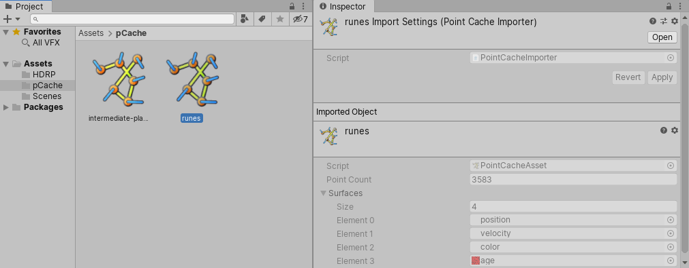
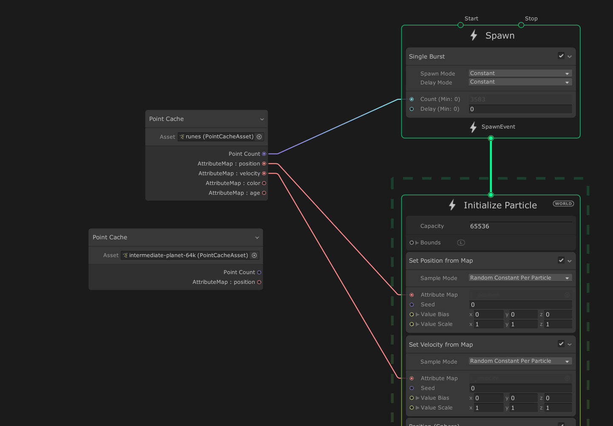

# Visual Effect Graph 中的点缓存

Point Cache 是一种资源，用于存储烘焙到纹理中的点及其属性。您可以使用 Point Caches 创建复杂几何体形状的粒子效果。

## 属性映射

Point Cache 将数据存储在属性映射中。属性贴图是特定点属性的值列表（点缓存中的每个点对应一个值）。例如，位置属性贴图存储 Point Cache 中每个点的位置。每个点都有一个索引，您可以使用该索引来访问其属性值。要获取点的属性数据，请在该点的索引处查找每个属性映射。您可以将 Point Cache 视为一个表，其中每列表示一个属性映射，每行表示一个点。例如：

|             | **Position** | **Normal** | **Color** |
| ----------- | ------------ | ---------- | --------- |
| **Point 1** | ...          | ...        | ...       |
| **Point 2** | ...          | ...        | ...       |
| **Point 3** | ...          | ...        | ...       |
| **Point 4** | ...          | ...        | ...       |
| **...**     | ...          | ...        | ...       |

## Point Cache 资源

Unity 将 Point Cache 作为资源导入并存储。Point Cache 资源遵循开源 [Point Cache](https://github.com/peeweek/pcache/blob/master/README.md) 规范并使用 `.pCache` 文件扩展名。它们没有可在 Inspector 中编辑的公共属性，但它们会显示只读信息，例如粒子数和表示粒子属性的纹理。有关 Point Cache 资源的更多信息以及它们在 Inspector 中显示的属性的描述，请参阅 [Point Cache 资源](point-cache-asset.md)。

## 使用 Point Cache

[Point Cache Operator](Operator-PointCache.md) 使您能够在视觉效果中使用 Point Cache。此 Operator 从 Point Cache 资源中提取粒子数量及其属性，并将它们作为输出端口显示在 Operator 中。然后，您可以将端口连接到其他节点，例如[映射块中的 Set <属性>](Block-SetAttributeFromMap.md)。

## 生成 Point Cache

要生成用于视觉效果的 Point Cache，可以使用以下任一方法：

- 内置的 [Point Cache Bake Tool](point-cache-bake-tool.md)
- 与 [*VFXToolbox*](https://github.com/Unity-Technologies/VFXToolbox) （位于 /DCC~ 文件夹中）捆绑在一起的 Houdini pCache 导出器使您能够烘焙点缓存。

- 您可以编写自己的导出器来写入 Point Cache 文件。有关 Point Cache 资产格式和规范的信息，请参阅 [pCache README](https://github.com/peeweek/pcache/blob/master/README.md)。

## 限制和注意事项

Importer 支持 `float` 和 `uchar` 属性类型。其他类型的任何属性都会返回错误。
