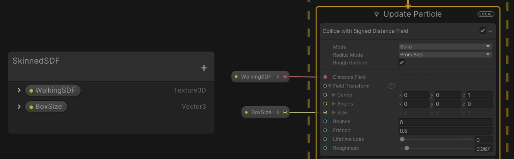

# SDF 烘焙工具 API

SDF Bake Tool API 使您能够在运行时和 Unity 编辑器中使用 C# 生成[有向距离场 （SDF）](sdf-in-vfx-graph.md) 资源。然后，您可以将生成的 SDF 资源用于视觉效果。

本页通过一个示例介绍如何使用 API 为蒙皮网格渲染器创建 SDF。每一帧，它都会从 Skinned Mesh Renderer 烘焙网格，从网格烘焙 SDF，然后将 SDF 传递给视觉效果。

请注意，烘焙 SDF 是一项资源密集型操作。如果需要每帧烘焙 SDF，最好使用低分辨率。

## Visual Effect Graph 设置

在 Visual Effect Graph 中，创建一个新的公开 Texture3D 属性。操作步骤：

1. 在 [Blackboard](VisualEffectGraphWindow.md#Blackboard), 中，单击添加 （+） 按钮。
2. 选择 **Texture3D**。
3. 双击新的 Texture3D，输入一个有意义的名称，然后按 Enter 键保存它。使用此名称来标识 C# API 中的属性。
4. 在新 Texture3D 的左侧，单击下拉箭头。
5. 启用 **Expoded**（如果尚未启用）。
6. 将属性拖动到图形中，并将其连接到接受 SDF 的输入。例如，[Collide With Signed Distance Field](Block-CollideWithSignedDistanceField.md) 块的 **Distance Field** 属性。

<br/>*将 SDF 分配给 Collide with Signed Distance Field 模块的 Distance Field 输入端口。*

## 单行为

创建一个新的 C# 脚本（**Assets** > **Create** > **C# Script**），将其命名为 VFXUpdateSkinnedSDF，并将其内容替换为下面的代码片段。VFXUpdateSkinnedSDF 组件处理 SkinnedMeshRenderer 组件和 Visual Effect 组件之间的交互。VFXUpdateSkinnedSDF 组件负责提取 SkinnedMeshRenderer 的网格的当前状态，使用 SDF Baker Tool API 从网格中烘焙 SDF，然后将结果传递给视觉效果。在每个阶段，VFXUpdateSkinnedSDF 组件执行以下操作：

1. **开始时**:
   - 获取对附加的 SkinnedMeshRenderer 和附加的 VisualEffect 的引用。
   - 创建 `MeshToSDFBaker` 的实例，该实例是负责从网格烘焙 SDF 的类。
   - 对 SkinnedMeshRenderer 的网格进行初始烘焙，并将生成的 SDF 纹理分配给在 [Visual Effect Graph 设置](#visual-effect-graph-设置)中设置的属性。

2. **更新时 (每帧)**:
   - 它会在当前状态下烘焙 SkinnedMeshRenderer 的网格，并将生成的 SDF 纹理分配给在 [Visual Effect Graph 设置](#visual-effect-graph-设置)中设置的属性。
  
3. **销毁时 (当销毁附加的游戏对象)**:
   - 运行`MeshToSDFBaker`实例的相关清理代码。

```c#
using UnityEngine;
using UnityEngine.VFX;
using UnityEngine.VFX.SDF;


public class VFXUpdateSkinnedSDF : MonoBehaviour
{
    MeshToSDFBaker m_Baker;
    SkinnedMeshRenderer m_SkinnedMeshRenderer;
    Mesh m_Mesh;
    VisualEffect m_Vfx;
    public int maxResolution = 64;
    public Vector3 center;
    public Vector3 sizeBox;
    public int signPassCount = 1;
    public float threshold = 0.5f;

    void Start()
    {
        m_Mesh = new Mesh();
        m_Vfx = GetComponent<VisualEffect>();
        m_SkinnedMeshRenderer = GetComponent<SkinnedMeshRenderer>();
        m_SkinnedMeshRenderer.BakeMesh(m_Mesh);
        m_Baker = new MeshToSDFBaker(sizeBox, center, maxResolution, m_Mesh, signPassCount, threshold);
        m_Baker.BakeSDF();
        m_Vfx.SetTexture("WalkingSDF", m_Baker.SdfTexture);
        m_Vfx.SetVector3("BoxSize", m_Baker.GetActualBoxSize());
    }
    void Update()
    {
        m_SkinnedMeshRenderer.BakeMesh(m_Mesh);
        m_Baker.BakeSDF();
        m_Vfx.SetTexture("WalkingSDF", m_Baker.SdfTexture);
    }

    void OnDestroy()
    {
        if (m_Baker != null)
        {
            m_Baker.Dispose();
        }
    }
}
```

将 VFXUpdateSkinnedSDF 组件附加到附加了 SkinnedMeshRenderer 组件和附加的 Visual Effect 组件的游戏对象。当您进入 Play 模式时，该组件将每帧更新 Visual Effect 中的 SDF。如果在 API 中难以设置[烘焙箱](sdf-bake-tool.md#baking-box)的中心和大小，可以打开 [SDF Bake Tool 窗口](sdf-bake-tool-window.md)，将 Mesh 和烤箱可视化。由于这只是为了可视化，因此您无需保存 SDF 资源。您还可以从 API 中检索用于烘焙纹理的[烘焙箱](sdf-bake-tool.md#baking-box)的大小。
