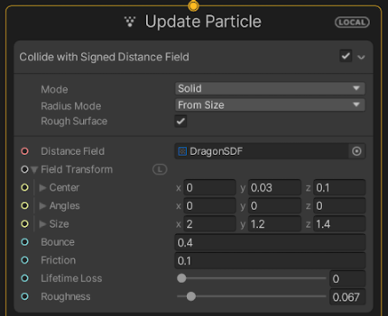
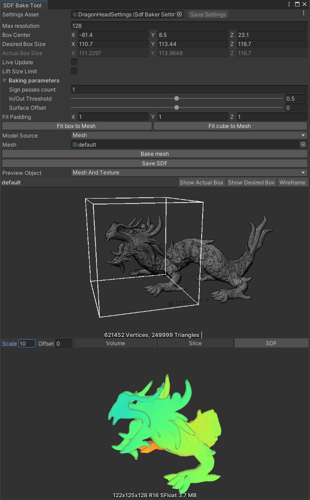
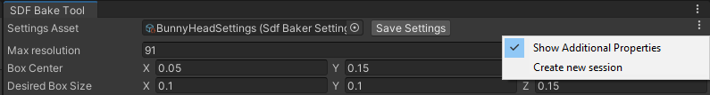

# SDF Bake Tool 窗口

SDF Bake Tool 窗口从包含网格的网格或预制件生成[有向距离场（SDF）](sdf-in-vfx-graph.md)资源。SDF Bake Tool 窗口在 Unity Editor 中运行。要在运行时烘焙 SDF，请参阅 [SDF 烘焙工具 API](sdf-bake-tool-api.md)。

要打开 SDF 烘焙工具窗口，请选择 **Window** > **Visual Effects** > **Utilities** > **SDF Bake Tool**。

## 使用 SDF Bake Tool 窗口

在 Unity Editor 的 [Visual Effect Graph 窗口](VisualEffectGraphWindow.md)中，块和运算符（如 [Collide With Signed Distance Field](Block-CollideWithSignedDistanceField.md)）将 SDF 作为输入。

*更新粒子上下文的屏幕截图*

要创建要在 Unity Editor 中使用的 SDF 资源，可以使用 SDF Bake Tool 窗口：

1. 打开 SDF Bake Tool 窗口（菜单： **Window** > **Visual Effects** > **Utilities** > **SDF Bake Tool**）  *窗口预览网格资源及其 SDF 表示。*
2. 选择要为其生成 SDF 表示的资源。如果要生成 SDF 来表示单个网格资源，请将 **Model Source** （模型源） 设置为 **Mesh** （网格）。如果要生成表示多个网格的 SDF，请将 **Model Source** （模型源） 设置为 **Prefab** （预制件）。此模式会生成一个 SDF，该 SDF 表示预制件层次结构中每个网格的组合。
3. 默认情况下，SDF 烘焙工具将[烘焙箱](sdf-bake-tool.md#baking-box)的边界设置为等于几何体的边界框。要缩放烘焙箱，请使用 **Box Size**（盒体大小）。要移动烘焙箱，请使用 **Box Center**。
4. 为生成的 SDF 纹理选择 **Maximal Resolution**。**Maximal Resolution** 对应于沿长方体最长边的分辨率。
5. 要使用当前属性预览结果，请选择 **Bake Mesh** （烘焙网格）。如果将**Preview Object**设置为 **None** 或 **Mesh**，则 SDF 烘焙工具窗口不会显示生成的 SDF 纹理。要显示纹理，请将 **Preview Object** （预览对象） 设置为 **Mesh And Texture** （网格和纹理） 或 **Texture** （纹理）。如果您希望预览在更改值时实时更新，请启用 **Live Update**。请注意，烘焙 SDF 是一项资源密集型操作。启用 **Live Update** 可能会导致速度变慢或不稳定，具体取决于计算机的功能。
6. 如果输入网格没有明确地将其内部与外部分开（例如，如果它包含孔、自相交、开放边界或自包含几何图形），则生成的 SDF 可能会错误分类某些区域。为了帮助缓解这些伪影，您可以手动公开新增 [属性](#properties) 。
7. 将 SDF 另存为项目中的资源：选择 **Save SDF**。SDF Bake （SDF 烘焙） 工具窗口将保存预览中当前可见的 SDF。

现在，您可以将生成的 SDF 资产用作多个块和运算符的输入。有关使用 SDF 资产的块和运算符的列表，请参阅 [Visual Effect Graph 中的 SDF](sdf-in-vfx-graph.md)。

为了更轻松地迭代有向距离字段，SDF Bake Tool 窗口使用资源来存储其属性值。这使您能够保存和恢复用于创建特定 SDF 纹理资源的设置。该窗口在 **Settings Asset** 设置资产属性中显示此资产。要将当前属性值保存到资源中，请单击 **Save Settings** 保存设置。要从其他资源恢复设置，请使用以下方法之一：

* 将资源分配给 **Settings Asset** 属性。
* 在 SDF Bake Tool 窗口打开的情况下，在 Project 窗口中选择资源。
* 在 Project （项目） 窗口中，双击该资源。如果 SDF Bake Tool 窗口未打开，则会打开窗口并指定资源。

注意: 将 SDF 资产与 C[ollide With Signed Distance Field](Block-CollideWithSignedDistanceField.md) 块一起使用。在块中，设置 **Field Transform** 的大小，以匹配您在 SDF 烘焙工具中使用的 **Box Size**。

## 属性

SDF Bake Tool 窗口包括默认属性（应适合大多数用例）和进一步调整烘焙过程的其他属性。默认情况下，其他属性不可见。要向他们展示：

1. 在窗口标题的右侧，选择 **More** 菜单。
2. 启用 **Show Additional Properties**。

*SDF Bake Tool 窗口和包含其他特性切换的上下文菜单。*

| **属性**            | **描述**                                              |
| ----------------------- | ------------------------------------------------------------ |
| **Settings Asset**      | 指定在此窗口中存储属性的设置资源。要保存当前设置，请单击 **Save Settings**。要从其他资源恢复设置，请将资源分配给此属性，在窗口打开时选择资源，或在窗口关闭时双击资源。 |
| **Maximal resolution**  | 生成的 3D 纹理的最大边的分辨率。 |
| **Box Center**          | [烘焙箱](sdf-bake-tool.md#baking-box)的中心。 |
| **Desired Box Size**    | [烘焙箱](sdf-bake-tool.md#baking-box)的所需的每轴大小。 |
| **Actual Box Size**     | [烘焙箱](sdf-bake-tool.md#baking-box)的实际每轴大小。这可能与所需的盒子尺寸略有不同，以确保质地中的体素是立方体的。|
| **Live Update**         | 指是否实时更新预览。如果启用此属性，则 SDF Bake Tool 会在此窗口中的每次属性更改时重新烘焙网格。如果将 **Maximal Resolution** 或 **Sign Pass Count** 设置为较高的值，则这可能是一个资源密集型操作。 |
| **Lift Size Limit**     | 启用此属性可烘焙到比默认最大值 256 3 更高的分辨率3.启用此属性时，烘焙纹理最多可以有 512 3个体素。高分辨率可能会占用大量资源。   当烘焙箱不是立方体时，**Maximal resolution** （最大分辨率） 是沿最长轴的体素数。这意味着最大分辨率可以高于 512。  仅当您[显示其他属性](#属性)时才会出现此属性。|
| **Baking Parameters**   | 当输入几何体没有明确地将内部和外部分开时（例如，由于孔或自相交），烘焙过程可能会产生不需要的结果。Inspector 的此 **Baking Parameters** 部分中的属性可以帮助缓解这些情况。  仅当您[显示其他属性](#属性)时才会出现这部分的属性。 |
| - **Sign Passes Count** | SDF 烘焙工具用于计算当前纹素是在网格内部还是外部的相邻纹素数。增加此值可减少由未明确将内部与外部分开的几何体引起的伪影 （例如，由于孔或自相交）。  仅当您[显示其他属性](#属性)时才会出现此属性。 |
| - **In/Out Threshold**  | SDF 烘焙工具将体素视为外部的阈值。为了将几何体的内部与外部分开，纹理中的每个纹素都有一个分数，用于确定它是否在外部。此属性的值较低意味着 SDF Bake Tool 将更多的点视为内部。此属性的值较高意味着 SDF 烘焙工具会认为更多的点位于外部。  仅当您[显示其他属性](#属性)时才会出现此属性。 |
| - **Surface Offset**    | 缩放 SDF 的表面。正值会放大 SDF 的表面，负值会缩小 SDF 的表面。  仅当您[显示其他属性](#属性)时才会出现此属性。 |
| **Fit Padding**         | 使用 **Fit Box to Mesh** 和 **Fit Cube to Mesh** 按钮时要应用的逐轴填充。  仅当您[显示其他属性](#属性)时才会出现此属性。 |
| **Fit Box to Mesh**     | 设置 [烘焙箱](sdf-bake-tool.md#baking-box) 的中心和大小，使其适合 Mesh 的边界。要在 Mesh 周围添加填充，请使用 **Fit Padding** 属性。 |
| **Fit Cube to Mesh**    | 设置[烘焙箱](sdf-bake-tool.md#baking-box)的中心和大小，以便它是包含网格边界的最小的立方体。因此，立方体的侧长与网格的最长侧匹配。要在网格周围添加填充物，请使用**Fit Padding** 属性。 |
| **Model Source**        | 指定输入 Mesh 的源。选项包括： &#8226; **Mesh**: 直接使用网格资产作为输入网格。 &#8226; **Mesh Prefab**: 使用预制件中的所有网格作为输入。此模式将创建一个 SDF，该 SDF 表示预制件层次结构中所有网格的组合。 |
| **Mesh**                | 要为其生成 SDF 的网格。  仅当您将 **Model Source** 设置为 **Mesh** 时，才会显示此属性。 |
| **Mesh Prefab**         | 要为其生成 SDF 的预制件。SDF Bake 工具将创建一个 SDF，该 SDF 表示此预制件层次结构中所有网格的组合。预制件必须至少包含一个引用网格的网格过滤器或蒙皮网格渲染器。对于蒙皮网格渲染器，SDF Bake Tool 使用其静止姿势的网格。  仅当您将 **Model Source** 设置为 **Mesh Prefab** 时，才会显示此属性。 |
| **Preview Object**      | 指定 SDF 烘焙工具如何显示 SDF 的预览。如果希望预览包含输出 SDF 纹理，则需要至少烘焙一次输入网格。如果预览输出 SDF 纹理，则这是 SDF 烘焙工具在选择 **Save SDF** 时保存的确切纹理。此属性的选项包括：  &#8226; **Mesh And Texture**: 并排显示输入网格和输出 SDF 纹理。 &#8226; **Mesh**: 显示输入 Mesh 的预览。 &#8226; **Texture**: 显示输出 SDF 纹理的预览。 &#8226; **None**: 不显示预览。 |
