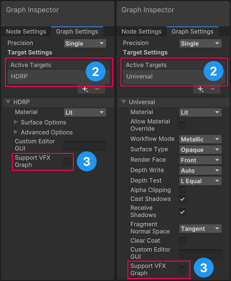
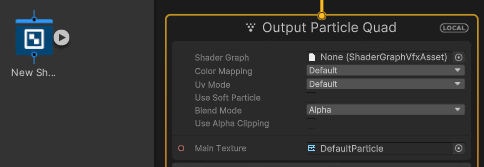

# 在 Visual Effect Graph 中使用 Shader Graph

Visual Effect Graph （VFX Graphs） 可以使用兼容的 Shader Graph 来渲染粒子。这使您能够构建要在视觉效果中使用的自定义着色器。本文档介绍：

- [在 Visual Effect Graph 中使用 Shader Graph](#在-visual-effect-graph-中使用-shader-graph)
  - [使 Shader Graph 与 Visual Effect Graph 兼容](#使-shader-graph-与-visual-effect-graph-兼容)
  - [升级您的项目](#升级您的项目)
  - [在 Visual Effect Graph 中使用 Shader Graph](#在-visual-effect-graph-中使用-shader-graph-1)
    - [Visual Effect Graph 输出兼容性](#visual-effect-graph-输出兼容性)
  - [已知限制](#已知限制)

## 使 Shader Graph 与 Visual Effect Graph 兼容

要使 Shader Graph 与 Visual Effect Graph 兼容，请执行以下操作：

1. 在 [Shader Graph window](https://docs.unity.cn/cn/Packages-cn/com.unity.shadergraph@latest/manual/index.html) 窗口中打开着色器。
2. 在 [Graph Settings 选项卡](https://docs.unity.cn/cn/Packages-cn/com.unity.shadergraph@latest/manual/Graph-Settings-Tab.html)中，指定渲染管道[目标](https://docs.unity.cn/cn/Packages-cn/com.unity.shadergraph@latest/manual/Graph-Target.html) （**HDRP** 或 **Universal**）。
3. 启用 **Support VFX Graph**.

与 Visual Effect Graph 兼容的 Shader Graph 着色器也可以用作常规着色器。大多数 HDRP 和 URP Shader Graph 着色器都支持 Visual Effect Graph。有关例外情况，请参阅[已知限制](#known-limitations)。

**注意**: VFX Graph 支持不会影响运行时性能，但使用 **Support VFX Graph** 的 Shader Graph 需要更长的时间来编译。

## 升级您的项目

Unity **2021.2** 及更早版本使用已弃用的 **Visual Effect** Target 将 Shader Graph 与 Visual Effect Graph 集成。

**Visual Effect** Target 限制了功能，并要求您使用以下各项：

- 专用 VFX 着色器
- [Metallic](https://docs.unity3d.com/Manual/StandardShaderMetallicVsSpecular.html) 工作流

要升级项目以使用新的渲染管线 Target：

1. 转到 **Edit** > **Preferences** > **Visual Effects**。
2. 启用 **Improved Shader Graph Generation**。
3. 在 [Graph Settings 选项卡](https://docs.unity.cn/cn/Packages-cn/com.unity.shadergraph@latest/manual/Graph-Settings-Tab.html) 添加 **HDRP** 或 **Universal Target**。
4. 启用 **Support VFX Graph**。
5. 移除 **Visual Effect** Target。

## 在 Visual Effect Graph 中使用 Shader Graph

要使用 Shader Graph 制作视觉效果：

1. 转到 **Edit** > **Preferences** > **Visual Effects**
2. 启用 **Experimental Operators/Blocks**。这将在输出中显示一个 Shader Graph 插槽。
3. 在 Visual Effect Graph 窗口中打开 Visual Effect Graph。如果您没有 Visual Effect Graph，请转到**Create** > **Visual Effects** > **Visual Effect Graph** 创建一个新的 Visual Effect Graph。
4. 在输出上下文的界面中，将兼容的 Shader Graph 分配给 **Shader Graph** 属性。为此，请直接在 Asset Picker 中搜索 Shader Graph，或将 Shader Graph 子资产拖动到 **Shader Graph** 插槽：
 
1. 单击输出上下文以在 Inspector 中查看它。

您可以在输出上下文中更改 Shader Graph 的 Surface Options。

**注意**: 您在 VFX Graph 中对 Shader Graph 所做的任何编辑都是 VFX Graph 的本地编辑，不会影响 Shader Graph 资源。

### Visual Effect Graph 输出兼容性

以下输出上下文支持 Shader Graphs：

- [Particle Mesh](https://docs.unity.cn/cn/Packages-cn/com.unity.visualeffectgraph@latest/manual/Context-OutputParticleMesh.html) （包括 Particle Lit Mesh）
- [Particle Primitive](https://docs.unity.cn/cn/Packages-cn/com.unity.visualeffectgraph@latest/manual/Context-OutputPrimitive.html) （包括 Particle Quad、Particle Triangle、Particle Octagon、Particle Lit Quad、Particle Lit Triangle 和 Particle Lit Octagon）
- Particle Strip Quad （包括 Particle Lit Strip Quad）

## 已知限制

Visual Effect Graph 不支持以下 [Blackboard](https://docs.unity.cn/cn/Packages-cn/com.unity.shadergraph@latest/manual/Blackboard.html) 功能：

- [Diffusion Profile](https://docs.unity.cn/cn/Packages-cn/com.unity.shadergraph@latest/manual/Diffusion-Profile-Node.html)
- [Virtual Texture](https://docs.unity3d.com/Manual/svt-use-in-shader-graph.html)
- [Gradient](https://docs.unity.cn/cn/Packages-cn/com.unity.shadergraph@latest/manual/Gradient-Node.html)
- [Keyword](https://docs.unity.cn/cn/Packages-cn/com.unity.shadergraph@latest/manual/Keywords.html)

Shader Graph 不支持特定目标中的某些功能。

- HDRP Target 不支持以下功能：
  - [Decal Shader Graph](https://docs.unity.cn/cn/Packages-cn/com.unity.render-pipelines.high-definition@latest/manual/master-stack-decal.html).
  - vertex animation的[Motion vectors](https://docs.unity.cn/cn/Packages-cn/com.unity.render-pipelines.high-definition@latest/manual/Motion-Vectors.html).

- URP 目标不支持以下各项：
  - [Sprite Shader Graphs](https://docs.unity.cn/cn/Packages-cn/com.unity.render-pipelines.universal@latest/manual/ShaderGraph.html) 和 [Decal Shader Graphs](https://docs.unity.cn/cn/Packages-cn/com.unity.render-pipelines.universal@latest/manual/decal-shader.html).

- Visual Effect Target（已弃用）不支持：
  - HDRP 或 Universal 材质类型。
  - 访问着色器的 Vertex 阶段。
