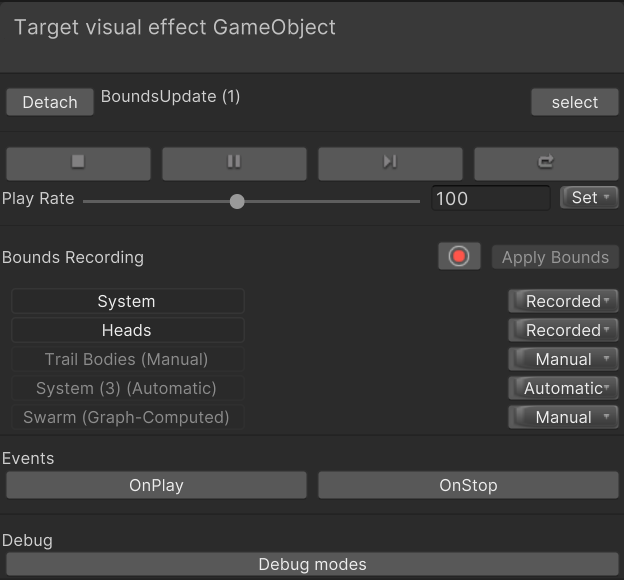
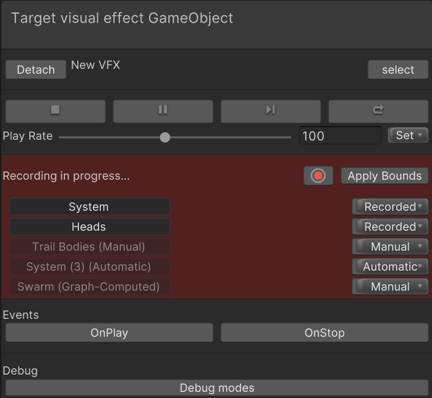
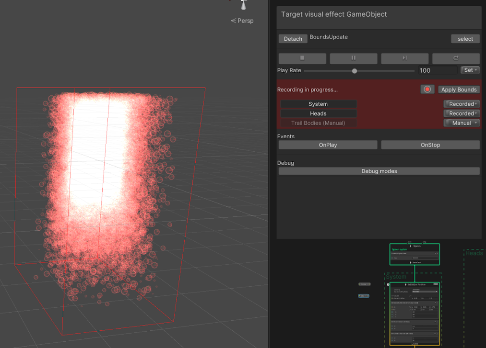

# Visual effect bounds 视觉效果边界

Unity 使用视觉效果的边界来确定是否渲染它。如果摄像机看不到效果的边界，则会剔除并且不会渲染效果。视觉效果中每个 System 的累积边界定义了视觉效果的边界。每个 System 的边界必须正确封装 System：

- 如果边界太大，则摄像机会处理视觉效果，即使屏幕上没有单个粒子。这会导致资源浪费。
- 如果边界太小，即使某些效果的粒子仍在屏幕上，Unity 也可能会剔除视觉效果。

视觉效果中的每个 System 都会在 [初始化上下文](Context-Initialize.md) 中定义其边界。默认情况下，Unity 会自动计算每个 System 的边界，但您可以更改此行为并使用其他方法来定义边界。Initialize Context 的 **Bounds Setting Mode** 属性控制视觉效果使用的方法。绑定的计算方法包括：

- **Manual**: 直接在 Initialize Context 中设置边界。您可以使用 Operators 动态计算边界，并将输出发送到 Initialize Context 的 **Bounds** 输入端口。
- **Recorded**: 允许您从 Target visual effect GameObject 面板录制系统。有关如何执行此操作的信息，请参阅 [Bounds recording](#bounds-recording)。在此模式下，您还可以使用 Operators 计算边界并将其传递给 Initialize Context，就像在**手册**中一样。这将覆盖任何记录的边界。
- **Automatic**: Unity 自动计算边界。注意：这将强制 VFX 资源的剔除标志为“Always recompute bounds and simulate”（始终重新计算边界和模拟）。

Initialize Context 还包含一个 **Bounds Padding** 输入端口。这是一个 Vector3，用于扩大 System 的每轴边界。如果系统使用 **Recorded** 或 **Automatic** 边界，则 Unity 会在 Update Context 期间计算系统的边界。这意味着在 Output Context （输出上下文） 中对粒子的大小、位置、缩放或枢轴所做的任何更改都不会影响该帧期间的边界。向边界添加填充有助于减轻这种影响。

## Bounds recording

Visual Effect Graph 窗口中的 [Target Visual Effect GameObject panel](VisualEffectGraphWindow.md#target-visual-effect-gameobject)包括 **Bounds Recording** 部分，可帮助您设置系统的边界。如果将 System 的 **Bounds Setting Mode** 设置为 **Recorded**，则该工具会在播放视觉效果时计算系统的边界。

> 不录制时的Target Visual Effect GameObject 面板界面。

> 录制时的 Target Visual Effect GameObject 面板界面。

您可以可视化录制器正在保存的边界。当录制器处于活动状态时，请查看 Scene 视图中的视觉效果。边界在视觉效果周围显示为一个红色框。如果要可视化特定系统的边界，请在工具窗口中选择它们或选择它们的 Initialize Context。

> Unity 正在录制的边界的视觉效果和预览。

录制时，您可以 **暂停、播放、重新开始** 或事件更改**播放速率**。这使您能够加快录制速度或模拟各种生成位置。当您对计算的边界感到满意时，单击 **Apply Bounds** 将记录的边界应用于系统。
