# 版本 10 / Unity 2020.2 的新增功能

本页概述了 Visual Effect Graph 版本 10 中的新增功能、改进和已解决的问题。

## 特征

以下是 Unity 添加到 Visual Effect Graph 版本 10 的功能列表。每个条目都包含功能摘要和指向任何相关文档的链接。

### CPU Output Event

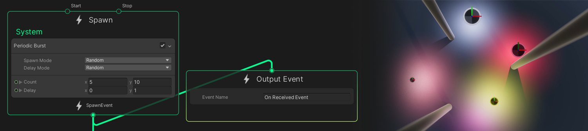

触发时，Output Event （输出事件） 会将事件从图形发送到 C#。您可以使用此选项将灯光、声音、物理反应或游戏与视觉效果同步。

有关此功能的更多信息，请参阅 [Output Event](Context-Event.md).


有关如何使用此功能的示例，请参阅 [输出事件处理程序](#outputevent-帮助程序)。

### 每个粒子网格 LOD（实验性）

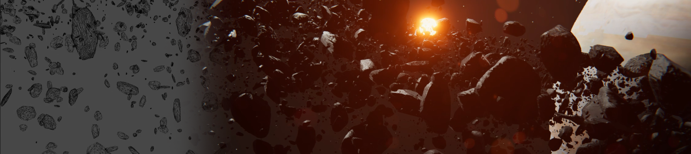

使用基于屏幕大小的 [LODs](https://docs.unity3d.com/Manual/LevelOfDetail.html) 优化网格粒子。

有关此功能的更多信息，请参见[粒子网格输出](Context-OutputParticleMesh.md)。

### 多网格（实验性）

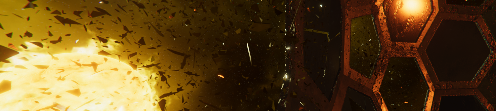

在同一个 [Particle Mesh Output](Context-OutputParticleMesh.md)中使用最多四个网格，以将每粒子的多样性添加到您的效果中。这使您能够为单个网格粒子添加视觉多样性，而无需使用多个 Outputs。

有关此功能的更多信息，请参见[输出粒子网格](Context-OutputParticleMesh.md)。特别是 ```Mesh Count ``` （网格计数）属性。

### 静态网格采样（实验性）

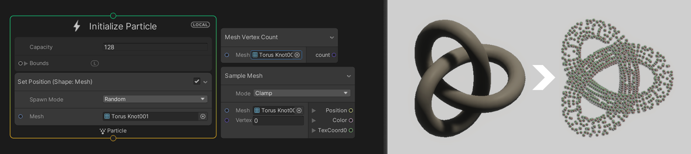

直接从网格生成粒子。这使您能够直接从网格中快速生成更复杂形状的粒子，而无需先将其位置烘焙到[点缓存](point-cache-in-vfx-graph.md)中。

您可以使用 Position （Mesh） Block 和 Sample Mesh Operator 对网格的顶点进行采样。

更多信息可以查阅 [Mesh sampling](MeshSampling.md)。

### Operators & Blocks

此版本的 Visual Effect Graph 引入了新的 Operator 和 Block：

* [Exp](Operator-Exp.md)
* [Log](Operator-Log.md)
* [LoadTexture](Operator-LoadTexture2D.md)
* [GetTextureDimensions](Operator-GetTextureDimensions.md)
* [WorldToViewportPoint](Operator-WorldToViewportPoint.md)
* [ViewportToWorldPoint](Operator-ViewportToWorldPoint.md)
* [Construct Matrix](Operator-ConstructMatrix.md)
* [TransformVector4](Operator-Transform(Vector4).md)

## 改进

以下是 Unity 在版本 10 中对 Visual Effect Graph 所做的改进列表。每个条目都包含改进摘要，以及指向任何文档的链接（如果相关）。

### 文档

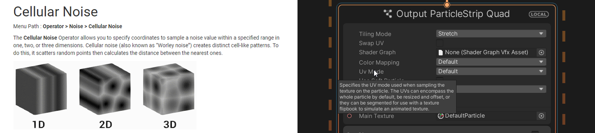

该文档现在包含有关 Visual Effect Graph 中所有节点的[参考信息](node-library.md)。此外，Attributes、Blocks、Contexts、Operators 以及各种菜单和选项现在都包含工具提示。

### 用户体验和工作流程

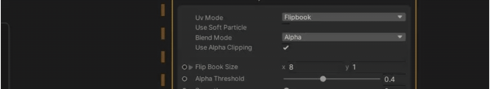

此版本的 Visual Effect Graph 引入了许多工作流程改进。列表如下：

+ 现在，坐标图视图中有一个 ```Save``` 按钮，用于保存当前打开的 Visual Effect Graph。
+ 现在，Unity 在导入 VFX 资源时会编译该资源。在此版本之前，Unity 会在您保存资源时对其进行编译。此改进解决了版本之间着色器的一些不兼容问题，并防止使用源代码管理创建不必要的更改。
+ 对 Edge 进行了多项改进：
    + 现在，如果您右键单击一条边，则有一个选项可以创建中间节点。
    + 如果从节点的输入建立连接，则可以在释放单击时按住 alt 以在空白处创建新的公开属性。公开的属性与您从中创建它的输入的类型相同。
    + 现在，当您复制连接的节点时，重复的节点具有相同的 Edge 连接。
+ 对 [Blackboard](Blackboard.md)进行了多项改进：
    + 如果您在 Blackboard 中右键单击，现在有一个选项可以删除未使用的属性。
    + int 和 uint 属性现在支持 [Range](https://docs.unity3d.com/ScriptReference/RangeAttribute.html) 和 [Min](https://docs.unity3d.com/ScriptReference/MinAttribute.html) 属性。
  + 您可以将 uint 属性作为枚举使用和查看。
+ Blocks & Nodes：
    + 位置（形状、顺序、深度）和速度来自方向和速度块现在包括位置和方向的合成。最初，他们只包括该位置的 composition。
    + 内置 Operator 现在提供新的时间访问权限。
    + 现在有一个用于 Update Context 的自定义 Inspector。这将显示 **Update Position** 和 **Update Rotation**，而不是 **Euler Integration**。<br/>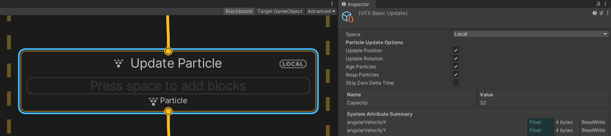
  + 现在有一个用于 Spawn Context 的自定义 Inspector，其中包含 loop 和 delay 设置，这在创建可自定义的生成行为时增加了另一层深度。<br/>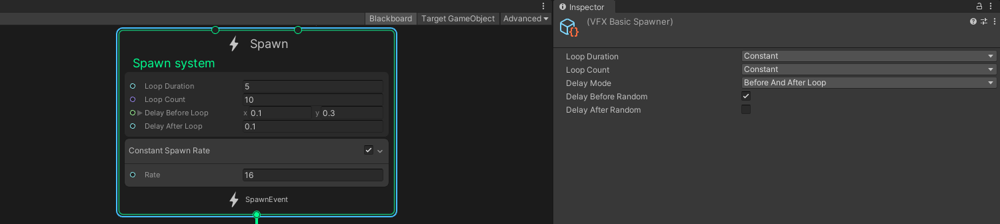

### 性能优化
此版本的 Visual Effect Graph 引入了多项性能优化：

+ Unity 现在使用计算着色器剔除粒子，以非常有效地丢弃非活动、屏幕外和无生命粒子的渲染。有关此功能的更多信息，请参[阅共享输出设置和属性](Context-OutputSharedSettings.md#particle-options-settings)属性。
+ Unity 现在会尽可能在 CPU 上处理噪声评估。最初，Unity 是按粒子执行此操作，而某些用例只要求对所有粒子执行一次。

### 有向距离场 SDF

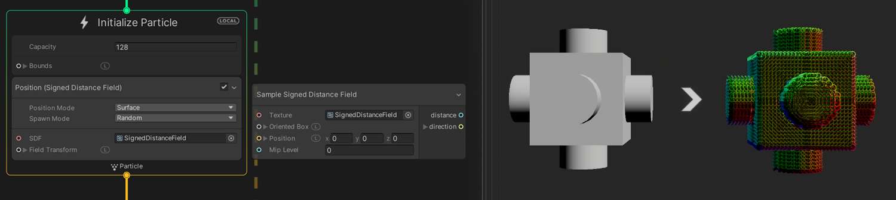

此版本的 Visual Effect Graph 引入了对使用有向距离场 （Signed distance field，SDF） 的改进。它添加了一个新的操作符来对 SDF 进行采样，并添加了一个新的 Block，用于根据 SDF 设置粒子的位置。

这些允许您创建自定义行为，例如检测粒子是否与 SDF 发生碰撞。

有关 SDF 运算符示例的更多信息，请参阅[有向距离场示例](Operator-SampleSDF.md)。

有关新位置块的更多信息，请参阅[位置（有向距离场）](Block-SetPosition(SignedDistanceField).md)。

### 失真输出

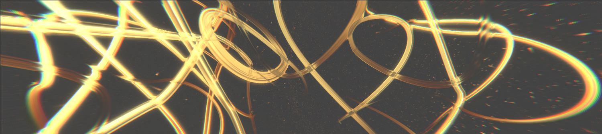

此版本的 Visual Effect Graph 引入了对失真输出的八边形和三角形支持。它还为粒子条带引入了新的 Output Distortion Quad Context。

有关 distortion Output 的更多信息，请参阅 [Output Distortion](Context-OutputDistortion.md)。

### 粒子条带

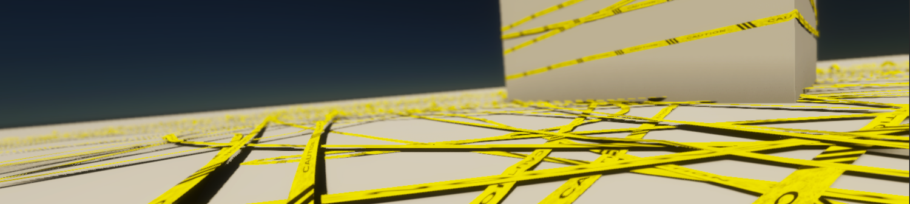

此版本的 Visual Effect Graph 引入了对粒子条带的多项改进：

+ 现在有用于四边形条带纹理映射的选项。您可以使用 UV 或自定义映射。
+ 条带输出的自定义 z 轴选项。这使您能够为条带设置自定义的前进方向，并使它们面向特定方向。例如，如果要在背对墙壁的墙壁上创建横幅，这将非常有用。
+ 粒子条带的新属性 particleCountInStrip 存储条带中的粒子数。
+ Initialize Context 中粒子条带的新属性 spawnIndexInStrip 充当 [spawnIndex](Operator-GetAttributeSpawnIndex).stores 的粒子条带等效项...

### Operators & Blocks

此版本的 Visual Effect Graph 引入了对 Operator 和 Block 的多项改进：

* [Compare](Operator-Compare.md) 运算符现在接受 ```int``` 和 ```uint``` 作为输入。
* 现在可以读取Spawn Context 中的属性。

## 样例

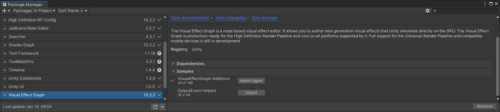

以下是 Unity 在版本 10 中创建或改进的 Visual Effect Graph Package 示例列表。每个条目都包含更改摘要，以及指向任何文档的链接（如果相关）。

### Visual Effect Graph 新增功能

此版本的 Visual Effect Graph 在 **Visual Effect Graph Additions Sample** 中引入了新的实用程序 Operator。

+ **获取条带进度**：此子图表可计算条带中粒子在 0 到 1 范围内的进度。这对于对曲线和渐变进行采样以便根据进度修改条带非常有用。
+ **Encompass（Point）**：一个子图，它扩大 AABox 的边界以包含一个点。
+ **度数转换弧度**和**弧度转换度数**：可帮助您在图表中在弧度和度数之间进行转换的子图。

### OutputEvent 帮助程序
此版本的 Visual Effect Graph 在 **OutputEvent Helpers** 示例中引入了新的帮助程序脚本，以帮助您设置 OutputEvents 的各种用例：
+ **Cinemachine Camera Shake(Cinemachine摄相机抖动)**：一个输出事件处理程序脚本，当发生给定输出事件时，通过 [Cinemachine 脉冲源](https://docs.unity3d.com/Packages/com.unity.cinemachine@latest?subfolder=/manual/CinemachineImpulseSourceOverview.html)触发摄像机抖动。

+ **Play audio(播放音频)**：一个 Output Event Handler 脚本，用于在给定输出事件发生时播放单个 AudioSource。

+ **Spawn a Prefab(生成预制件)**：一个输出事件处理程序脚本，用于在给定输出事件上生成预制件（从池中管理）。它使用 position、angle、scale 和 lifetime 来定位预制件，并在延迟后将其禁用。要同步其他值，您可以在 Prefab 中使用其他脚本。
  + **Change Prefab Light(更改预制件光源)**：演示如何将光源与效果同步的示例。
  + **Change Prefab RigidBody Velocity(更改RigidBody速度)**：一个示例，演示如何将更改 RigidBody 的速度与效果同步。
+ **RigidBody**：一个输出事件处理程序脚本，用于在给定输出事件发生时向 RigidBody 应用力或速度变化。
+ **Unity Event**：一个输出事件处理程序，在给定输出事件发生时引发 UnityEvent。

## 已解决的问题
有关 Visual Effect Graph 版本 10 中已解决的问题的信息，请参阅[更改日志](../changelog/CHANGELOG.html).
