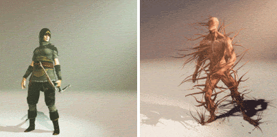
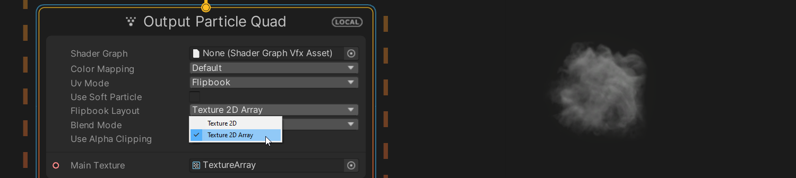
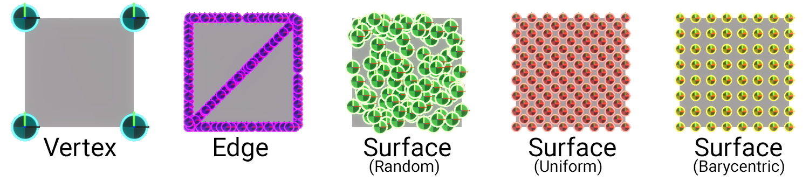

# What's new in version 11

本页概述了 Visual Effect Graph 版本 11 中嵌入的新功能、改进和已解决的问题，嵌入在 Unity 2021.1 中。

## 特征
以下是 Unity 添加到 Visual Effect Graph 版本 11 的功能列表，嵌入在 Unity 2021.1 中。每个条目都包含功能摘要和指向任何相关文档的链接。

### SRP 包是核心的一部分
随着 Unity 2021.1 的发布，图形包正在重新定位到 Unity 的核心。此举简化了使用新 Unity 图形功能的体验，并确保您的项目始终在经过最新验证的图形代码上运行。

对于每个 Unity 版本（Alpha / Beta /patch release），图形代码都嵌入在主 Unity 安装程序中。安装最新版本的 Unity 时，您还可以获得最新的 URP、HDRP、Shader Graph、VFX Graph 等。

将图形包与主 Unity 版本更紧密地绑定可以更好地进行测试，以确保您使用的图形包已与您下载的 Unity 版本进行了广泛测试。

您还可以通过在清单文件中覆盖图形包来使用图形包的本地副本或自定义版本。

有关更多信息，请参阅论坛上的以下帖子： [SRP v11 测试版现已推出](https://forum.unity.com/threads/srp-v11-beta-is-available-now.1046539/).

### SkinnedMeshRenderer sampling

> 在 SkinnedMeshRenderers 的表面上生成的粒子示例。来自 [Mixamo.com](https://www.mixamo.com/) 的模型和动画。

此版本的 Visual Effect Graph 添加了对 [SkinnedMeshRenders](https://docs.unity3d.com/ScriptReference/SkinnedMeshRenderer.html) 进行采样的功能。这使您能够从蒙皮几何体中检索顶点数据，并将其用于各种目的，例如在动画角色上生成粒子。

有关此功能的更多信息，请参阅[网格示例](Operator-SampleMesh.md)。

### Texture2DArray flipbooks

> 带有 **Texture2DArray** 选项的 **Flipbook Layout** 属性。

在此版本的 Visual Effect Graph 中，您可以将 Texture2DArray 资源用作翻页动画。使用 Texture2DArrays 可以防止 Flipbook 帧之间的纹理渗出。要使用 Texture2DArrays，请将输出上下文的 **Flipbook Layout** 设置为 **Texture 2D Array**。这使您能够将 Texture2DArray 资源分配给上下文的纹理端口。纹理的每个切片对应于 flipbook 中的一个帧。要播放 Flipbook，请使用 [Flipbook Player](Block-FlipbookPlayer.md) Block。要通常与 Texture2DArray flipbook 交互，请使用 **Tex Index** 属性。如果要将 flipbook 用于非动画目的，例如每个粒子使用随机 flipbook 帧，这将非常有用。

许多输出上下文共享此设置，因此，有关更多信息，请参阅[共享输出设置和属性](Context-OutputSharedSettings.md)。

### 从时间抗锯齿中排除

> **左图**：使用时间抗锯齿 （TAA）。余烬更难看到，小的根本不存在。 **中图**：从 TAA 中排除视觉效果。所有余烬都更清晰，小余烬仍然可见，并且图像的其余部分使用抗锯齿。 **右图**：不使用 TAA。所有余烬都更清晰，小余烬仍然可见，但图像的其余部分没有消除锯齿。

此版本的 Visual Effect Graph 允许您在 Unity 计算[时间抗锯齿（TAA）](https://docs.unity.cn/cn/Packages-cn/com.unity.render-pipelines.high-definition@latest?subfolder=/manual/Anti-Aliasing.html%23temporal-anti-aliasing-taa) 时排除视觉效果。这很有用，因为 TAA 会导致小颗粒消失。TAA 仅在高清渲染管线 （HDRP） 中可用，这意味着此功能仅与 HDRP 相关。

许多输出上下文共享此设置，因此，有关更多信息，请参阅[共享输出设置和属性](Context-OutputSharedSettings.md)。

### Operators

此版本的 Visual Effect Graph 引入了新的 Operator：

+ [采样点缓存](Operator-SamplePointCache.md)
- [示例属性贴图](Operator-SampleAttributeMap.md)

## 改进

以下是 Unity 在 Unity 2021.1 中嵌入的 Visual Effect Graph 版本 11 中所做的改进列表。每个条目都包含改进摘要，以及指向任何文档的链接（如果相关）。

### 网格采样改进

> 此版本支持的新采样方法的示例。

此版本的 Visual Effect Graph 改进了网格采样，因此您现在可以从网格的边缘和表面进行采样。此外，所有纹理坐标样本输出现在都返回 Vector4 而不是 Vector2。这使您能够将更多每顶点数据从效果传递到着色器。最后，此版本添加了对使用浮点数存储 Colors 的支持。最初，Visual Effect Graph 仅支持字节存储。

有关这些改进的更多信息，请参阅[网格示例](Operator-SampleMesh.md)。

## 已解决的问题
有关 Visual Effect Graph 版本 11 中已解决的问题的信息，请参阅[更改日志](../changelog/CHANGELOG.html)。
