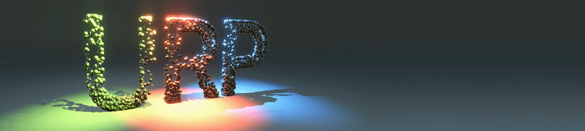
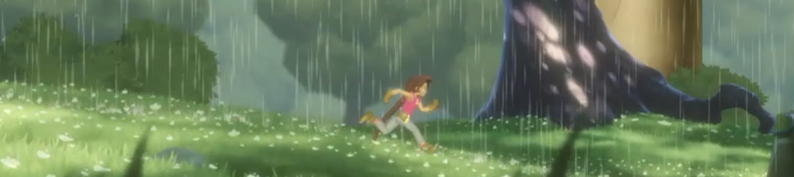
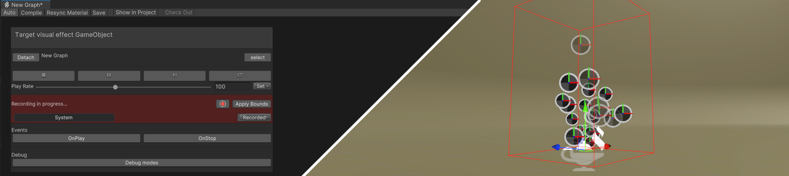
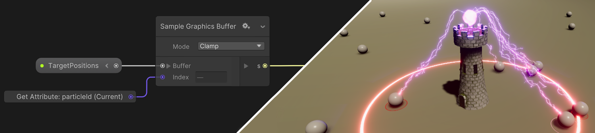
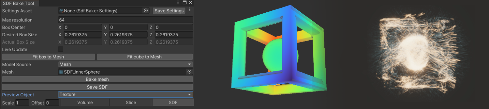
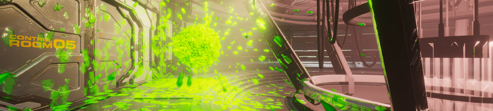
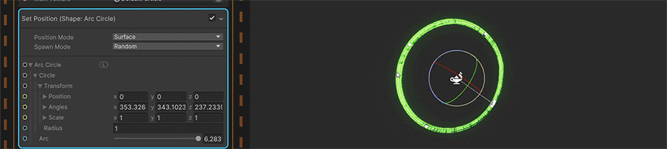
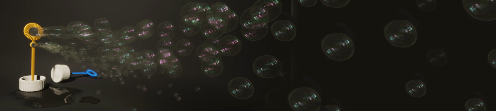
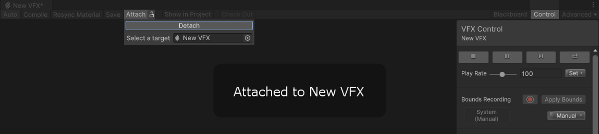
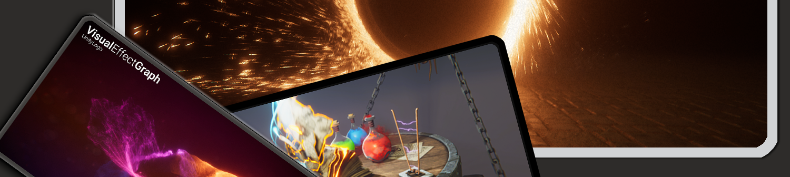

# 版本 12 / Unity 2021.2 中的新增功能

本页概述了 Unity 2021.2 中嵌入的 Visual Effect Graph 版本 12 中的新功能、改进和已解决的问题。

### 新功能

以下是 Unity 添加到 Visual Effect Graph 版本 12 中的功能列表，嵌入在 Unity 2021.12 中每个条目都包含功能摘要和指向任何相关文档的链接。

### 修复了通用渲染管线 （URP） 的光照输出

此版本的 Visual Effect Graph 在 Universal Render Pipeline （URP） 中添加了对光照输出的支持。您可以使用它来创建可以响应场景中的照明的效果。

### 2D 渲染器支持（支持计算的设备）

在此版本中，Visual Effect Graph 增加了对通用渲染管道 （URP） 2D 渲染器的支持。这意味着您现在可以在 2D 项目中渲染效果，并将它们与场景中的 sprite 一起排序。

有关更多信息，请参阅[在通用渲染管道中渲染](https://docs.unity.cn/cn/Packages-cn/com.unity.render-pipelines.universal@latest/manual/rendering-in-universalrp.html)。

## 边界帮助程序

此版本的 Visual Effect Graph 添加了用于设置和处理边界的帮助程序。现在，您可以在 Target GameObject 窗口中记录边界，以确保更准确的拟合。您还可以自动设置边界以确保它们始终可见。

此功能可帮助您创建与其系统匹配的精确边界，以便效果不会在摄像机移动时意外消失。

有关更多信息，请参阅[视觉效果边界](visual-effect-bounds.md)。

### 图形缓冲区支持

VFX 版本 12.0 还增加了对图形缓冲区的支持。这使得处理大量数据并将其传输到 Visual Effect Graph 变得更加容易。这对于跟踪图形中的多个游戏对象位置特别有用。

此功能需要 C# 知识来设置和处理图形缓冲区。

### 有向距离场烘焙工具

此版本包括新的有向距离场 （SDF） 烘焙工具。要访问它，请导航到 Windows > Visual Effects > Utilities > SDF Bake Tool。您可以使用此工具快速将网格和预制件转换为 SDF 资源，这些资源可用于创建各种效果，例如自定义碰撞，或使粒子符合特定形状。

有关更多信息，请参阅 Visual Effect Graph 中的[有向距离场](sdf-in-vfx-graph.md)。

### HDRP 贴花输出

此版本的 VFX 图表添加了 Lit Decal 输出，允许您在高清渲染管线 （HDRP） 中使用光照粒子贴花。您可以使用它来创建许多效果;例如，在场景中的多个曲面上添加污垢或损坏。

## 更新

以下是 Unity 在 12.0 版中对 Visual Effect Graph 所做的改进列表，这些改进嵌入在 Unity 2021.2 中。每个条目都包含改进摘要，以及指向任何文档的链接（如果相关）。

### 变换形状

此 VFX 图形版本为各种形状块和运算符添加了转换，使它们更易于使用并为您提供更精确的控制。例如，您可以使用此变换来旋转 Position Circle 块，使圆形朝向新方向，或者在一个轴上缩放球体碰撞块的形状，以便与椭球体碰撞。

### 升级的 ShaderGraph 集成

此 VFX Graph 版本改进了 Shader Graph 和 Visual Effect Graph 在通用渲染管线 （URP） 和高清渲染管线 （HDRP） 中的相互集成方式。

这使您可以访问许多强大的工具，包括：

+ VFX Graph 中的完整 URP 和 HDRP 材质类型现已推出。
+ 现在，您可以在顶点阶段修改粒子。这对于详细效果非常有用。例如，您可以对鸟群中的鸟翅进行动画处理。
+ 您现在可以将现有的 Shader Graph 用于常规材质和视觉效果。为了实现这一点，专用的 Visual Effect 目标现已弃用。

### 附件工作流

VFX Graph 12.0 包括一个新的工作流程，用于将视觉效果附加到场景中的实例：当 Visual Effect 资源在 Visual Effect 窗口中打开时，当您选择它时，它会自动将自身附加到实例。

附加效果后，您可以使用各种辅助工具，并使用它来可视化某些 Gizmo。

### URP 高端移动支持（支持计算的设备）

此版本的 Visual Effect Graph 应用了大量修复和稳定性改进，允许您在一系列支持移动计算的设备和 XR 平台上使用视觉效果。

**免责声明：**

移动设备上的计算支持因品牌、移动 GPU 架构和操作系统而异。这意味着 VFX Graph 只能正式支持一部分高端移动设备，其他设备在运行它时可能会遇到问题。对于大多数移动应用程序，请使用 Unity 的[内置粒子系统](https://docs.unity.cn/cn/tuanjiemanual/Manual/PartSysUsage.html)。

## 修复问题
有关 Unity 2021.2 中嵌入的 Visual Effect Graph 版本 12 中已解决的问题的信息，请参阅[更改日志](../changelog/CHANGELOG.html)。
